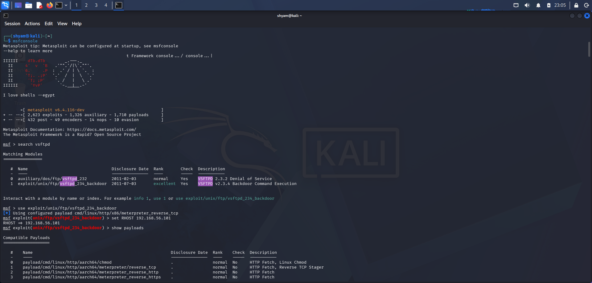
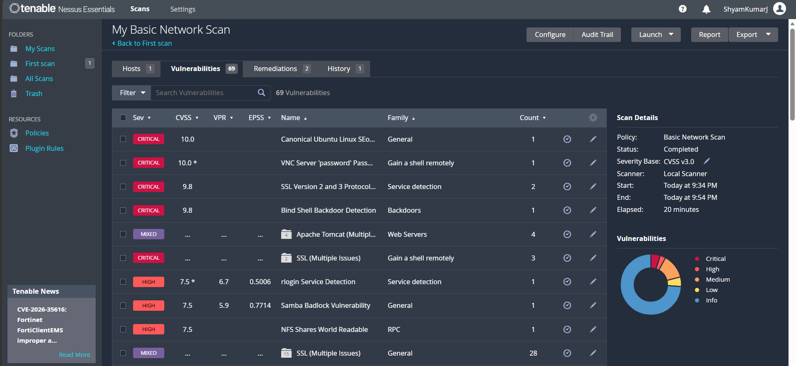
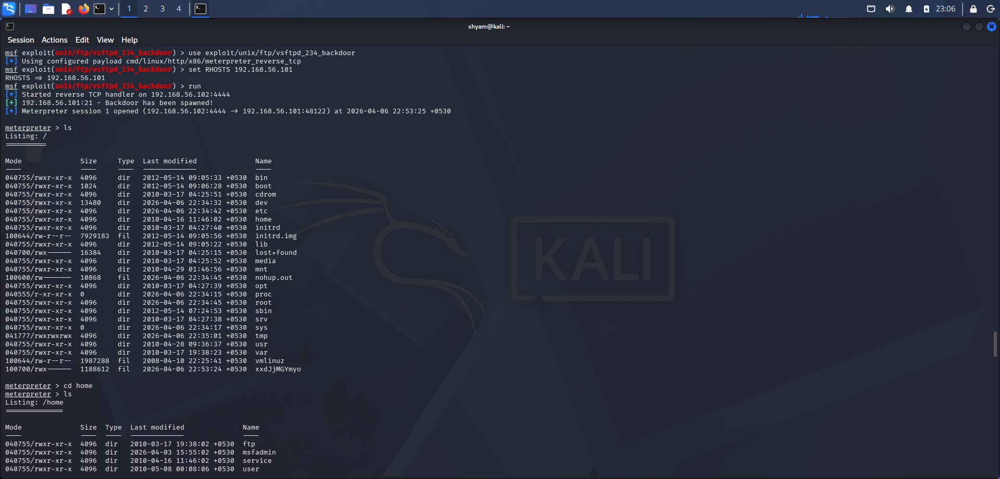

# 🔐 Metasploitable2 Penetration Testing Project

## 📌 Overview
This project demonstrates a complete penetration testing workflow on a vulnerable machine (Metasploitable2). The goal was to identify, analyze, and exploit vulnerabilities in a controlled lab environment.

---

## 🛠 Tools Used
- Nmap
- Nessus
- Metasploit Framework
- Kali Linux

---

## 🔍 Reconnaissance
Performed network scanning to identify open ports and services:

---

## 🧪 Vulnerability Analysis
Used Nessus to identify vulnerabilities. Detected a critical vulnerability in VSFTPD 2.3.4:

---

## 💥 Exploitation
Exploited the VSFTPD backdoor using Metasploit:

---

## ⚠️ Impact
- Unauthorized system access
- Potential data exposure
- Full system compromise

---

## 🛡 Mitigation
- Update VSFTPD to latest version
- Disable unnecessary services
- Apply firewall rules

---

## 🎯 Conclusion
Successfully demonstrated how outdated services can lead to critical system compromise in a controlled environment.
